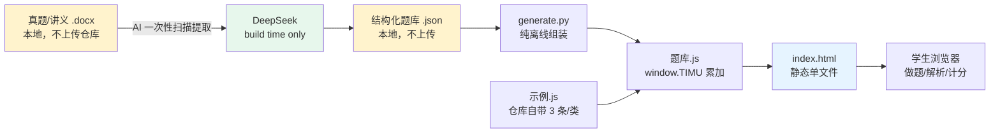

<!-- TODO Emrys：标题里的项目名你拍板。我先用「中考语文基础综合题库 · 教具版」占位。 -->
# 中考语文基础综合题库 · 教具版

一个一对一语文老师的课堂教具。覆盖北京中考"基础综合"题组里的 8 种题型，每组 7 题随机组卷，学生在浏览器里做、做完出对错和解析。

<!-- TODO Emrys：录一段 30 秒的 demo gif/mp4 放这里。建议用 macOS 的 ⌘+Shift+5（屏幕录制）→ 用任意 gif 转换工具转一下。
     录制内容：刷新页面 → 7 题混合（成语 / 字音字形 / 病句 / 标点 / 词语 / 对联 / 仿写补写 / 病句语段）→ 点选项秒出对错+解析 → 仿写题在文本框输入 → 看到参考答案 → 看总结页分数。
     文件命名 demo.gif 放到根目录，下面这行去掉 HTML 注释即可。 -->
<!--  -->

---

## 这玩意儿能干什么

- 8 种中考题型：成语、字音字形、词语（语境填词）、病句（单句版）、病句（语段版）、标点、对联、仿写/补写
- 一组 7 题随机组卷（题型配比可调）
- 客观题秒判对错，开放题（仿写/补写）写完亮参考答案
- 浏览器单文件运行，不要服务器、不要联网（题库是离线 JSON）
- 老师自己电脑 / Mac mini 一启动就用，零部署成本

不能干什么：不是商业产品，没账号系统、没数据库、没多人协作。教具，不是平台。

---

## 工程上有意思的几个点（不是营销话术）

### 1. AI 只在 build time，不在 runtime

DeepSeek 只在**构建题库阶段**被调用一次（扫真题资料 → 提取出干净的结构化题库）。学生做题时**完全离线**，浏览器 fetch 的是预生成好的 `.js` 文件，不调 API、不联网、零延迟、零成本、零限流风险。

为什么这个决策很关键：之前尝试过"运行时让 AI 生成题目"，失败了——AI 写的语段会随机有质量问题、自检不可靠、生成慢、有 API 费。改成 build-time 离线管线后，运行时是确定的，AI 风险被压在题库审核环节，老师抽查通过就稳。

### 2. 每题型独立插件式架构

```
tiku_demo/
├── index.html              # 主界面（不动）
├── deepseek_key.txt        # API key（gitignored）
├── idioms/                 # 成语题
├── pinyin/                 # 字音字形题
├── error_sentence/         # 病句·单句版
├── error_passage/          # 病句·语段版
├── punctuation/            # 标点
├── diction/                # 词语（语境填词）
├── couplet/                # 对联
├── composition/            # 仿写/补写
└── tools/                  # 仓库维护脚本
```

每个题型文件夹独立：自己的 `build_db.py`（如有结构化清单源）+ `extract_with_ai.py`（如需从真题 AI 抽）+ `generate.py`（出题库 JS）+ `示例.js`（仓库自带 demo 数据）+ `题库.js`（用户跑出的真库，gitignored）。

主程序通过两个机制连起来：
- **题库累加**：每个 `题库.js` 都 `window.TIMU = (window.TIMU||[]).concat(...)`，多个题型自动并到一个数组
- **配额组卷**：`const QUOTA = { '成语':2, '字音字形':1, ... }` 决定每组 7 题怎么分配
- **渲染分派**：`renderQuestion` 按 `q.type` 调对应的 `bodyXxx` 函数

加新题型只动这三处，不碰主流程。

### 3. 提示词分三层

```
prompt_layer1_format.txt  # 模型/格式适配层 —— 换模型时只改这个
prompt_layer2_task.txt    # 任务结构层    —— 描述任务逻辑，基本通用
prompt_layer3_voice.txt   # 质感/口味层   —— 决定生成质量的护城河
```

第一层（"输出 JSON 不要 markdown"这种）几乎不通用、但也最不值钱，换 DeepSeek 到 Qwen 改半小时就行。
第二层（任务硬性规则）通用度高。
第三层（用 few-shot 锚定"什么叫好"，含手写范文）最值钱，**换任何模型都带着走**。换工作场景时，第三层是你的资产。

### 4. 数据提取的可靠性策略

真题来自一堆杂乱 docx，AI 抽取的可靠性靠这几条堆出来：

- **Chunk overlap**：相邻文本块留 1500 字 overlap，防止题目被切断到两块都拿不全
- **严格输出校验**：抽出后过滤掉不符合形式特征的（如补写题 context < 120 字、标点题 passage 含 ABCD 残渣、字形复原差字数对不上）
- **自检循环**：成语题、字音字形题生成后再让 DeepSeek 当阅卷老师过一遍，不一致就丢弃重生成
- **库去重**：按主键去重（passage / sentence 首 60 字）

### 5. 架构图（诚实版）



灰底（黄）= 本地私有；绿 = 一次性消耗的 AI；蓝 = 用户直接接触的界面。

---

## 题型覆盖

| 题型 | 形式 | 数据来源 | 渲染 |
|---|---|---|---|
| 成语 | 语段里 4 个加点成语，选用错的一项 | AI 生成（基于易误用清单+设误机制库） | 语段+4 成语按钮 |
| 字音字形 | 4 选 1，每项含"加点字注音 + 词语书写" | 字音库+字形库纯离线组合 | 无语段，4 组合按钮 |
| 词语 | 语段挖空，4 个近义词组合选最恰当 | 真题 AI 抽取 | 语段+4 字符串按钮 |
| 病句 | 4 个独立句子选有语病的一项 | 真题 AI 抽取+清单补全 | 无语段，4 句按钮 |
| 病句·语段版 | 一段话里 4 处标号句①②③④选有语病的一项 | 真题 AI 抽取 | 语段+4 句按钮 |
| 标点 | 语段【甲】【乙】挖空，选标点组合 | 真题 AI 抽取 | 语段+4 标点组合按钮 |
| 对联 | 给上联，选最合适的下联 | 真题 AI 抽取 | 上联框+4 下联按钮 |
| 仿写/补写 | 开放题，学生写文本，提交后亮 2-3 条参考答案 | 真题 AI 抽取 | 文本框+提交按钮 |

---

## 真实的迭代记录（踩坑→修正）

不是所有路都走通的。记录几个关键的转弯，给以后碰到类似问题的人参考：

- **字音字形 + 病句 + 成语 塞同一个语段** 失败：试图让一道题组用一个 200 字语段同时考三类，AI 在过约束下生成质量崩、自检大量误判。解法：**解耦成各自独立题型**，靠 QUOTA 配额混合而不是物理混合
- **病句库出现 `（表领属）（动词短语）` 这种语法标注括号**：源 docx 里多重定语的诊断行带语法术语，跑进题库选项里。解法：加白名单清理函数，过滤"括号内只有语法术语"的部分
- **仿写补写的 context 平均 64 字**：AI 一开始只抽了挖空附近一句，丢了上下文。学生没法填。解法：① prompt 强调"context 必须整段" ② 加 chunk overlap 1500 字防止被切 ③ 抽出后硬校验补写题 context ≥ 120 字
- **D 选项概率 17/30 偏高**：DeepSeek 写语段时习惯先铺"用对的 3 个"再抖出"用错的那个"，导致错项总落在最后一位。解法：HTML 层 `shuffleOptions` 加洗牌（同时保留某些题型 `fixedOrder: true` 的位置语义）
- **答案选项语义反向 bug**：成语题答案是 `correct:false`（用错那项），字音字形题答案是 `correct:true`（全对那项），shuffleOptions 用同一个公式找答案就错。解法：用 `answerOpt = options[answerIndex]` 跟踪答案对象身份，shuffle 后 `indexOf` 找新位置，与题型语义无关

---

## 快速开始

### 用户视角（你 clone 之后能立即看到 demo）

```bash
git clone <这个仓库>
cd tiku_demo
open index.html
```

浏览器自动打开。每题型自带 3 条示例数据，能跑通整套界面（共 24 条 demo）。

### 自己生成真题库

需要：
1. DeepSeek API key（在 https://platform.deepseek.com/ 注册）
2. 你自己的真题资料（docx），每个题型可能有不同来源
3. Python 3.9+（macOS 自带）

步骤：

```bash
# 1. 配 key
echo "sk-你的key" > deepseek_key.txt

# 2. 准备资料（成语为例）
cp 你的成语清单.txt idioms/初中阶段易误用成语清单.txt
cp 你的600成语.txt idioms/600个高频成语.txt

# 3. 解析清单
cd idioms && python3 build_db.py

# 4. AI 生成题（调 API，每道几分钱）
python3 generate.py 30        # 生成 30 道
python3 generate.py 20        # 追加 20 道（默认 append 模式）
python3 generate.py 20 fresh  # 清空重建

# 5. 刷新浏览器
```

其他题型类似，每个文件夹的 `extract_with_ai.py` / `generate.py` 注释里写了用法。

### 部署到 Mac mini / 笔记本（局域网用）

题库是静态文件，开个简易服务器即可：

```bash
cd tiku_demo
python3 -m http.server 8080
```

然后机房里的 iPad / 笔记本访问 `http://你的Mac的IP:8080` 就能用。

---

## 如何加新题型（5 分钟扩展）

假设要加"古诗默写"：

```bash
mkdir mosheng
# 在里面写 generate.py，输出一个 题库.js 包含：
#   window.TIMU = (window.TIMU||[]).concat([
#     {type:'默写', stem:'补出诗句空缺',
#      passage:'独在异乡为异客，______', options:[...], answerIndex:0}
#   ])
```

主程序改三处：

```html
<!-- index.html 里加一行 script -->
<script src="mosheng/示例.js"></script>  <script src="mosheng/题库.js"></script>
```

```javascript
// 主脚本里：
const QUOTA = { ..., '默写': 1 };        // 加配额

function bodyMosheng(q, idx, answered){    // 写渲染函数
  // ...
}

// renderQuestion 分派加一行
: (q.type === '默写') ? bodyMosheng(q, idx, answered)
```

完事。

---

## 局限和已知问题

- 客观题答案是 AI 从真题里抽出来的，**质量取决于源数据**，偶尔会有原文解析就有问题的题流到选项里。生产用前抽样审一遍是必要的。
- 真题数据有版权，**不要把 `题库.json` 和 `*.docx` push 到公网仓库**（`.gitignore` 已经排除）。
- 字音字形库由清单解析+OCR 来，少数读音可能有 OCR 残留误差，做题时偶尔会碰到一个明显错的，欢迎提 issue。
- 仿写/补写没做 AI 自动评分（DeepSeek 评开放题不够稳）。设计上是"学生写 → 看参考 → 老师课上点评"，不是"AI 打分"。要加评分留了接口位但默认关闭。

---

## License

<!-- TODO Emrys：选个 license。建议 MIT（最宽松）或 Apache-2.0（保留你署名）。
     如果你担心被商用，用 CC-BY-NC-4.0（仅非商用）。
     选定后在仓库根目录加 LICENSE 文件即可。 -->
TBD

## 致谢 / 关于作者

<!-- TODO Emrys：你自己填。建议写：
     - 你是谁（一句话，比如"北京某机构一对一语文老师"）
     - 为什么做这个（一句话，比如"备课时反复手出基础题太费时间，做一个 AI 协助的版本"）
     - 联系方式（可选：邮箱 / GitHub）
     这部分如果你打算用作求职作品集，可以写得稍正式一点。 -->
TBD

---

<!-- TODO Emrys：如果想体现"踩在真实业务一线"的可信度，下面这段可以打开：
> 项目从 2026 年 5 月开始迭代，源于带学生备战中考时的实际需求：基础综合题需要大量练习量，
> 而手写卷子+对答案+做诊断的工序占用了课前 1-2 小时。当前 8 个题型在课堂里实际使用中。
-->
